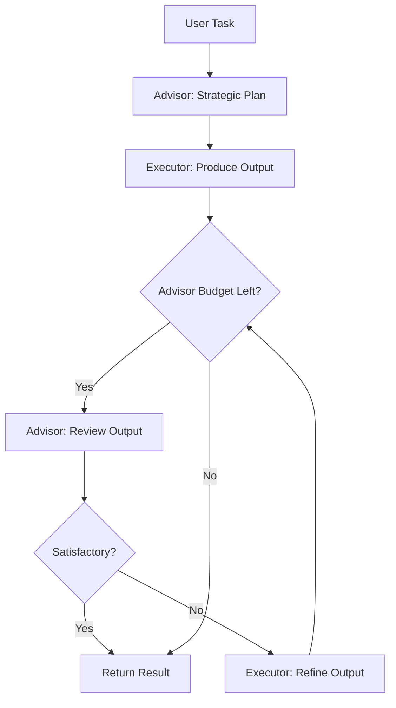

# `AdvisorSwarm`

The `AdvisorSwarm` implements the [advisor strategy](https://claude.com/blog/the-advisor-strategy) described in Anthropic's research (April 2026). It pairs a cheaper **executor** model that drives the task end-to-end with a powerful **advisor** model that is consulted only at key decision points.

The advisor never calls tools or produces user-facing output — it only provides strategic guidance to the executor.

This is provider-agnostic: any model supported by LiteLLM works for either role.



The swarm follows this workflow:

1. **Advisor plans**: Receives the task, produces a concise numbered strategic plan
2. **Executor executes**: Works on the task using the advisor's guidance
3. **Advisor reviews**: Evaluates the executor's output — returns `VERDICT: SATISFACTORY` or `VERDICT: NEEDS_REVISION`
4. **Executor refines**: If revision needed, addresses each point from the advisor's feedback
5. **Repeat 3-4** until the advisor says satisfactory or the advisor call budget is exhausted


## Key Features

| Feature | Description |
|---------|-------------|
| **Advisor-Executor Separation** | Advisor provides strategy; executor does the work |
| **Iterative Refinement** | Advisor reviews and executor refines until satisfactory |
| **Budget Control** | `max_advisor_uses` caps advisor calls per run |
| **Provider-Agnostic** | Any LiteLLM-supported model works for either role |
| **Custom Agents** | Pass pre-configured agents with tools, MCP, or any Agent settings |
| **Multi-Loop** | Optional outer loops for deeper iterative analysis |


## Constructor

### `AdvisorSwarm.__init__()`

| Parameter | Type | Default | Required | Description |
|-----------|------|---------|----------|-------------|
| `name` | `str` | `"AdvisorSwarm"` | No | Human-readable name |
| `description` | `str` | `"An executor-advisor swarm..."` | No | Description of the swarm's purpose |
| `executor_model_name` | `str` | `"claude-sonnet-4-6"` | No | Model for the executor agent |
| `advisor_model_name` | `str` | `"claude-opus-4-6"` | No | Model for the advisor agent |
| `executor_system_prompt` | `str` | Built-in | No | System prompt for the executor |
| `advisor_system_prompt` | `str` | Built-in | No | System prompt for the advisor |
| `max_advisor_uses` | `int` | `3` | No | Max advisor calls per `run()`. Budget: 1 plan + up to N-1 reviews |
| `max_loops` | `int` | `1` | No | Outer iteration count (each loop is a full plan-execute-review cycle) |
| `output_type` | `OutputType` | `"dict-all-except-first"` | No | Format for output (dict, str, list, final, json, yaml) |
| `verbose` | `bool` | `False` | No | Enable detailed logging |
| `executor_agent` | `Agent` | `None` | No | Pre-configured Agent for execution (e.g., with tools or MCP) |
| `advisor_agent` | `Agent` | `None` | No | Pre-configured Agent for advising |
| `tools` | `List[Callable]` | `None` | No | Tools available to the executor agent only |

#### Raises

| Exception | Condition |
|-----------|-----------|
| `ValueError` | If `max_advisor_uses < 1`, `max_loops < 1`, or model names are empty |

---

## Core Methods

### `run()`

Execute the advisor-executor orchestration flow.

| Parameter | Type | Default | Required | Description |
|-----------|------|---------|----------|-------------|
| `task` | `str` | — | **Yes** | The task to accomplish |
| `img` | `str` | `None` | No | Optional single image input |
| `imgs` | `List[str]` | `None` | No | Optional list of image inputs |

#### Returns

| Type | Description |
|------|-------------|
| `Any` | Formatted conversation history according to `output_type` |

---

### `batched_run()`

Run the swarm on multiple tasks sequentially.

| Parameter | Type | Default | Required | Description |
|-----------|------|---------|----------|-------------|
| `tasks` | `List[str]` | — | **Yes** | List of task strings |

#### Returns

| Type | Description |
|------|-------------|
| `List[Any]` | List of results, one per task |

---

## Usage Examples

### Basic Usage

```python
from swarms import AdvisorSwarm

swarm = AdvisorSwarm(
    executor_model_name="claude-sonnet-4-6",
    advisor_model_name="claude-opus-4-6",
    max_advisor_uses=3,
    verbose=True,
)

result = swarm.run(
    "Write a Python function that implements binary search on a sorted list. "
    "Include proper error handling, type hints, and edge cases."
)

print(result)
```

### Custom Executor with Tools

Pass a pre-configured executor agent with tools while keeping the advisor tool-free:

```python
from swarms import Agent, AdvisorSwarm


def write_file(filename: str, content: str) -> str:
    """Write content to a file."""
    with open(filename, "w") as f:
        f.write(content)
    return f"Written: {filename}"


def read_file(filename: str) -> str:
    """Read content from a file."""
    with open(filename, "r") as f:
        return f.read()


executor = Agent(
    agent_name="Executor",
    model_name="claude-sonnet-4-6",
    max_loops=1,
    tools=[write_file, read_file],
)

swarm = AdvisorSwarm(
    executor_agent=executor,
    advisor_model_name="claude-opus-4-6",
)

result = swarm.run("Create a Python module for string manipulation utilities")
```

### Batched Tasks

```python
from swarms import AdvisorSwarm

swarm = AdvisorSwarm(
    executor_model_name="claude-sonnet-4-6",
    advisor_model_name="claude-opus-4-6",
    max_advisor_uses=2,
)

results = swarm.batched_run([
    "Explain recursion with a simple example",
    "What is the difference between a mutex and a semaphore?",
])
```

### Different Providers

The swarm is provider-agnostic. Use any models LiteLLM supports:

```python
from swarms import AdvisorSwarm

# OpenAI models
swarm = AdvisorSwarm(
    executor_model_name="gpt-4.1-mini",
    advisor_model_name="gpt-4.1",
)

# Mix providers
swarm = AdvisorSwarm(
    executor_model_name="gpt-4.1-mini",
    advisor_model_name="claude-opus-4-6",
)
```

---

## Architecture Details

### Advisor Budget

The `max_advisor_uses` parameter controls how many times the advisor is consulted per `run()` call:

| `max_advisor_uses` | Behavior |
|---|---|
| `1` | Advisor plans only. No review — executor output is final. |
| `2` | Advisor plans + 1 review. If satisfactory, done. If not, executor refines but no further review. |
| `3` (default) | Advisor plans + up to 2 review-refine cycles. |
| `N` | Advisor plans + up to N-1 review-refine cycles. |

### Verdict Protocol

The advisor's review must start with one of two verdicts:

- `VERDICT: SATISFACTORY` — output meets requirements, refinement loop stops
- `VERDICT: NEEDS_REVISION` — followed by specific, actionable feedback for the executor

This is enforced by the advisor's system prompt and parsed by the swarm via case-insensitive substring matching.

### Multi-Loop

When `max_loops > 1`, the entire plan-execute-review cycle repeats. Each subsequent loop has access to the full conversation history from previous loops, enabling iterative deepening. The advisor budget resets each loop.

### Context Flow

The advisor sees the full conversation history on every call. This matches the advisor strategy's principle that the advisor needs complete context to provide relevant guidance.
