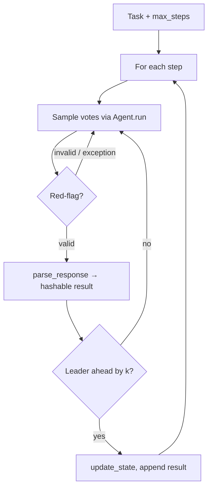

# MAKER

**MAKER** (**M**aximal **A**gentic decomposition, first-to-ahead-by-**K** **E**rror correction, and **R**ed-flagging) is a task-agnostic orchestrator for long-horizon problems. It decomposes work into many small steps; at each step it samples LLM outputs, discards bad ones (red-flagging), and commits only when one parsed answer leads the next-best by `k` votes (“first-to-ahead-by-k”).

This implementation follows the framework described in *Solving a Million-Step LLM Task with Zero Errors* (Meyerson et al., 2025) — [arXiv:2511.09030](https://arxiv.org/abs/2511.09030).

**Import:** `from swarms.structs.maker import MAKER`

## When to use MAKER

| Use MAKER when… | Consider something else when… |
|-----------------|-------------------------------|
| You can express the problem as a fixed or conditionally bounded sequence of steps | You need a fixed DAG of different agents ([GraphWorkflow](graph_workflow.md)) |
| Each step should be a single focused LLM call with statistical agreement | You want multi-agent debate + judge ([DebateWithJudge](debate_with_judge.md)) |
| You care about per-step reliability (voting + validation) over raw speed | You only need one-shot or simple majority across agents ([MajorityVoting](majorityvoting.md)) |

## How it works



1. **MAD (maximal agentic decomposition)** — You run up to `max_steps` iterations; each iteration is one micro-step with a prompt built from the task, optional state, step index, and the previous step’s result (`format_prompt`).
2. **First-to-ahead-by-k voting** — Parsed answers are counted until some candidate’s count is at least `k` greater than every other candidate (`do_voting`). Optional **`run_parallel_voting`** batches the first round of samples with a thread pool.
3. **Red-flagging** — Before parsing, `validate_response` can reject outputs (default rejects empty or overly long text vs `max_tokens`).

## Constructor parameters

| Parameter | Role |
|-----------|------|
| `model_name`, `system_prompt`, `max_tokens`, `temperature`, `temperature_first` | Passed through to per-step `Agent` instances (first vote often uses `temperature_first=0`). |
| `k` | Votes a winner must lead the runner-up by (higher ⇒ more reliable, more cost). |
| `format_prompt(task, state, step_idx, previous_result)` | Builds the user prompt for the current step. |
| `parse_response(text)` | Turns raw LLM output into a **hashable** result for voting (strings, numbers, tuples of primitives, etc.). |
| `validate_response(text, max_tokens)` | Returns `False` to discard a sample. |
| `update_state(state, result, step_idx)` | Fold step output into state (default: unchanged). |
| `initial_state` | Starting state for `run` / `run_until_condition`. |
| `max_workers` | Thread pool size for `run_parallel_voting` (default: `k`). |
| `max_retries_per_step` | Cap on samples per step before `RuntimeError`. |
| `agents` | Optional list of pre-built `Agent`s; votes cycle through this pool instead of creating fresh micro-agents. |

## Main methods

| Method | Description |
|--------|-------------|
| `run(task, max_steps)` | Run exactly `max_steps` voting rounds; returns `list` of per-step results. |
| `run_until_condition(task, stop_condition, max_steps=1000)` | Like `run`, but before each step the loop checks `stop_condition(state, results, step_idx)`; if true, it exits without running another vote for that index. |
| `run_parallel_voting(task, max_steps)` | Like `run` but uses parallel sampling for the first batch of votes per step. |
| `get_statistics()` | Copy of internal counters (samples, votes, red-flags, per-step vote/sample lists). |
| `reset()` | Clears stats and conversation. |
| `estimate_cost(total_steps, target_success_probability=0.95)` | Heuristic cost / `k` guidance from paper-style estimates (uses run statistics when available). |

## Minimal example

```python
from swarms.structs.maker import MAKER


def format_prompt(task, state, step_idx, previous_result):
    prev = f"\nPrevious: {previous_result}" if previous_result is not None else ""
    return f"{task}\nStep {step_idx + 1} of the plan. One short line only.{prev}"


def parse_response(response: str) -> str:
    return response.strip().splitlines()[0]


def validate_response(response: str, max_tokens: int) -> bool:
    if not response.strip():
        return False
    return len(response) // 4 <= max_tokens  # rough token estimate, same idea as default


maker = MAKER(
    name="LineByLine",
    model_name="gpt-4.1-mini",
    system_prompt="Answer in one short line per step.",
    format_prompt=format_prompt,
    parse_response=parse_response,
    validate_response=validate_response,
    k=2,
    verbose=True,
)

results = maker.run(task="List three benefits of unit tests, one per step.", max_steps=3)
print(results)
```

## Related

- Source: `swarms/structs/maker.py` (module and class docstrings mirror this behavior).
- [MajorityVoting](majorityvoting.md) — multi-agent loops with a consensus agent, not step-wise first-to-ahead-by-k on a decomposed trajectory.
