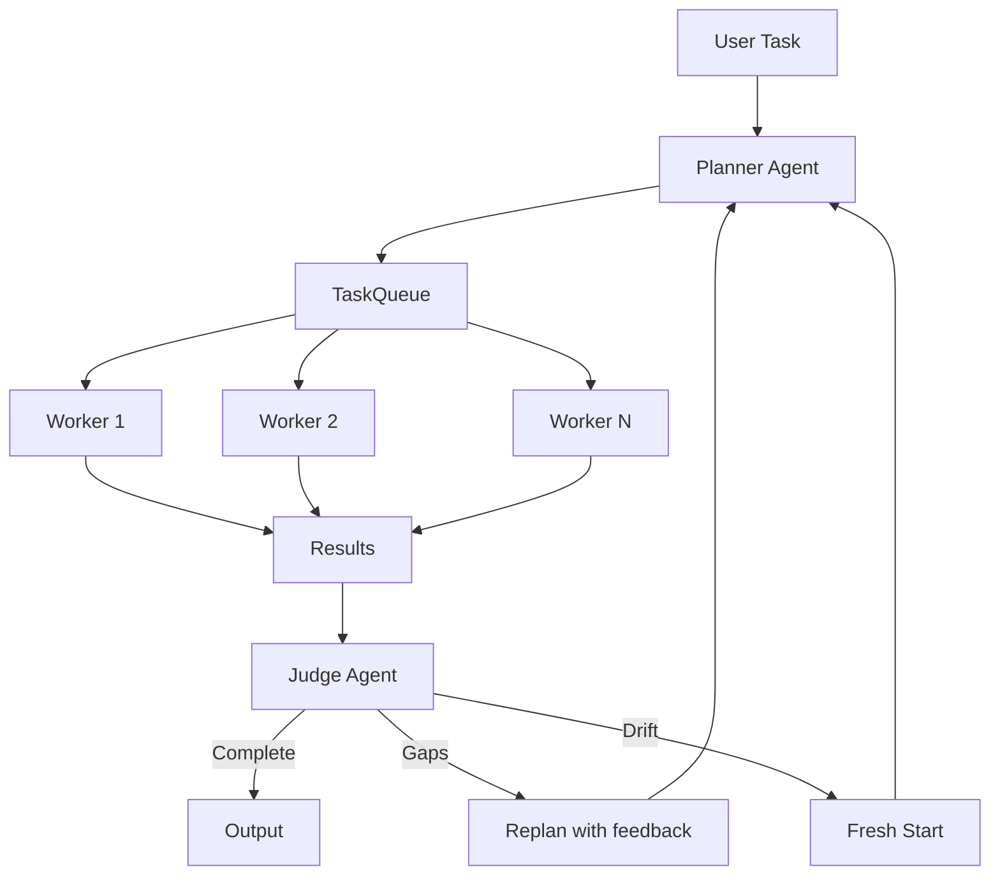

# `PlannerWorkerSwarm`

The `PlannerWorkerSwarm` implements a planner-worker-judge architecture for parallel multi-agent task execution. Based on Cursor's ["Scaling long-running autonomous coding"](https://cursor.com/blog/scaling-agents) research, it separates planning from execution: a planner decomposes goals into prioritized tasks, worker agents claim and execute tasks concurrently from a shared queue, and a judge evaluates the cycle results.



The swarm follows a cycle-based workflow:

1. **Planning**: A planner agent decomposes the goal into concrete, prioritized tasks with dependencies
2. **Execution**: Worker agents independently claim tasks from a shared queue and execute them concurrently via `ThreadPoolExecutor` — no worker-to-worker coordination
3. **Evaluation**: A judge agent evaluates the combined results and decides: complete, fill gaps, or fresh start
4. **Iteration**: If not complete, the planner receives judge feedback and produces new tasks for the next cycle

## Quick Start

```python
from swarms import Agent
from swarms.structs.planner_worker_swarm import PlannerWorkerSwarm

swarm = PlannerWorkerSwarm(
    agents=[
        Agent(agent_name="Research", agent_description="Gathers information", model_name="gpt-5.4", max_loops=1),
        Agent(agent_name="Analysis", agent_description="Analyzes data", model_name="gpt-5.4", max_loops=1),
    ],
    max_loops=1,
    max_workers=2,
    worker_timeout=120,
)

result = swarm.run("What are the top 3 benefits of renewable energy?")
print(result)
```

## Key Features

| Feature | Description |
|---|---|
| **Separation of Concerns** | Planners only plan, workers only execute — enforced through dedicated system prompts |
| **Parallel Worker Execution** | Workers run concurrently in a `ThreadPoolExecutor` with configurable `max_workers` |
| **Optimistic Concurrency** | Task queue uses version fields instead of locks — workers never block each other |
| **No Worker Coordination** | Workers interact only with the task queue, not with each other |
| **Judge-Driven Cycles** | A judge evaluates results and determines: complete, fill gaps, or fresh start |
| **Fresh Start Mechanism** | Combats accumulated drift by discarding all prior work and replanning from scratch |
| **Task Dependencies** | Tasks can declare dependencies on other tasks; blocked tasks wait until prerequisites complete |
| **Priority Scheduling** | Tasks are claimed highest-priority first (CRITICAL > HIGH > NORMAL > LOW) |
| **Recursive Sub-Planners** | CRITICAL tasks can be automatically decomposed by sub-planner agents |
| **Automatic Retry** | Failed tasks reset to PENDING if retries remain |
| **Per-Task Timeout** | Detects stuck workers via configurable per-task timeout |
| **Pool-Level Timeout** | Stops all workers after a deadline to prevent runaway execution |
| **Worker Memory Reset** | Agent short memory is reset between tasks so prior work doesn't leak |
| **Dependency Context** | Results from completed prerequisite tasks are passed as context to dependent tasks |
| **SwarmRouter Integration** | Available as `"PlannerWorkerSwarm"` swarm type in `SwarmRouter` |

## Architecture

### Design Principles (from the Cursor blog)

| Cursor Principle | Implementation |
|---|---|
| Planners plan, workers execute | `_run_planner()` produces `PlannerTaskSpec`; workers get `WORKER_SYSTEM_PROMPT` enforcing "only execute, never plan" |
| No worker-to-worker coordination | Workers interact only with `TaskQueue.claim()` — atomic, no shared state |
| No locks / optimistic concurrency | `TaskQueue` uses a version field per task; `claim()` is atomic under a minimal lock, but workers never block each other |
| Judge-driven cycles with fresh start | `CycleVerdict.needs_fresh_start` triggers `TaskQueue.clear()` to combat accumulated drift |
| Prompts matter more than infrastructure | `WORKER_SYSTEM_PROMPT`, `PLANNER_SYSTEM_PROMPT`, and `JUDGE_SYSTEM_PROMPT` enforce strict role boundaries |
| Horizontal scaling | `ThreadPoolExecutor(max_workers=N)` — tested with 200 tasks across 100 threads, zero double-claims |

### Task State Machine

```
PENDING ──→ CLAIMED ──→ RUNNING ──→ COMPLETED
                          │
                          ▼
                        FAILED ──→ PENDING (retry)
                          │
                          ▼ (retries exhausted)
                        FAILED (permanent)

Any non-terminal ──→ CANCELLED
```

### Cycle Flow

```
Cycle 1:
  Planner receives: original task
  Workers execute: tasks from queue
  Judge evaluates: complete? gaps? drift?

Cycle 2+ (if not complete):
  If fresh start: clear ALL tasks, planner starts from scratch with judge feedback
  If gap fill: clear non-terminal tasks, preserve completed results
  Planner receives: original task + judge feedback + identified gaps
  Workers execute: new tasks
  Judge re-evaluates
```

## Constructor

### `PlannerWorkerSwarm.__init__()`

#### Parameters

| Parameter | Type | Default | Required | Description |
|---|---|---|---|---|
| `name` | `str` | `"PlannerWorkerSwarm"` | No | Name identifier for this swarm instance |
| `description` | `str` | `"A planner-worker execution swarm"` | No | Description of the swarm's purpose |
| `agents` | `List[Union[Agent, Callable]]` | `None` | **Yes** | Worker agents that execute tasks. Must not be empty |
| `max_loops` | `int` | `1` | No | Maximum planner-worker-judge cycles (must be > 0) |
| `planner_model_name` | `str` | `"gpt-5.4"` | No | Model for the planner agent |
| `judge_model_name` | `str` | `"gpt-5.4"` | No | Model for the judge agent |
| `max_planner_depth` | `int` | `1` | No | Max recursive sub-planner depth. `1` = no sub-planners; `2` = CRITICAL tasks are decomposed once |
| `worker_timeout` | `Optional[float]` | `None` | No | Max seconds for the entire worker pool per cycle |
| `task_timeout` | `Optional[float]` | `None` | No | Max seconds per individual task execution |
| `max_workers` | `Optional[int]` | `None` | No | Max concurrent worker threads. Defaults to `min(len(agents), os.cpu_count())` |
| `output_type` | `OutputType` | `"dict-all-except-first"` | No | Format for the final result |
| `autosave` | `bool` | `False` | No | Whether to save conversation history |
| `verbose` | `bool` | `False` | No | Enable verbose logging |

#### Raises

| Exception | Condition |
|---|---|
| `ValueError` | If no agents are provided or `max_loops <= 0` |

---

## Core Methods

### `run()`

Executes the planner-worker-judge cycle up to `max_loops` times or until the judge declares the goal complete.

#### Parameters

| Parameter | Type | Default | Required | Description |
|---|---|---|---|---|
| `task` | `Optional[str]` | `None` | **Yes** | The goal to accomplish |
| `img` | `Optional[str]` | `None` | No | Optional image input |

#### Returns

| Type | Description |
|---|---|
| `Any` | Formatted conversation history per `output_type` |

#### Raises

| Exception | Condition |
|---|---|
| `ValueError` | If `task` is not provided |

#### Example

```python
from swarms import Agent
from swarms.structs.planner_worker_swarm import PlannerWorkerSwarm

workers = [
    Agent(
        agent_name="Research-Agent",
        agent_description="Gathers factual information and data",
        model_name="gpt-5.4",
        max_loops=1,
    ),
    Agent(
        agent_name="Analysis-Agent",
        agent_description="Analyzes data and identifies patterns",
        model_name="gpt-5.4",
        max_loops=1,
    ),
]

swarm = PlannerWorkerSwarm(
    name="Research-Swarm",
    agents=workers,
    max_loops=2,
    max_workers=2,
    worker_timeout=120,
)

result = swarm.run(task="What are the top 3 benefits of renewable energy?")
print(result)
```

---

### `get_status()`

Returns a structured status report of the swarm and its task queue.

#### Returns

| Type | Description |
|---|---|
| `Dict[str, Any]` | Status dict with `name`, `original_task`, and `queue` (containing `total`, `progress`, `status_counts`, and per-task details) |

#### Example

```python
status = swarm.get_status()
print(f"Progress: {status['queue']['progress']}")
for task in status["queue"]["tasks"]:
    print(f"  [{task['status']}] {task['title']} -> {task['assigned_worker']}")
```

---

## How It Works

### Planner Agent

Created internally each cycle. Uses structured output (`PlannerTaskSpec`) to produce a plan narrative and a list of concrete tasks with title, description, priority (0-3), and dependency titles. On subsequent cycles, the planner receives the judge's feedback (gaps + follow-up instructions) appended to the original task.

### Worker Execution

Each worker runs in a `ThreadPoolExecutor` thread, independently claiming tasks from a shared `TaskQueue`. Workers never coordinate with each other. Each worker loop: claims a task, resets agent memory, builds context (`WORKER_SYSTEM_PROMPT` + task description + dependency results), executes via `agent.run()`, and marks the task complete or failed.

**Optimistic concurrency**: every task has a `version` field. State transitions check the expected version — if another worker modified the task, the operation is rejected. This avoids lock-based coordination problems (deadlocks, forgotten releases).

**Claim priority**: highest priority first, then oldest first, with dependency satisfaction required.

### Judge Agent

Created internally after workers complete. Evaluates the cycle results and produces a `CycleVerdict`:

| Field | Type | Description |
|---|---|---|
| `is_complete` | `bool` | Whether the goal has been fully achieved |
| `overall_quality` | `int` (0-10) | Quality score of the combined results |
| `summary` | `str` | Brief assessment of what was accomplished |
| `gaps` | `List[str]` | Specific missing items or issues |
| `follow_up_instructions` | `Optional[str]` | Instructions for the planner if another cycle is needed |
| `needs_fresh_start` | `bool` | Whether accumulated drift requires discarding all prior work |

### Fresh Start vs Gap Fill

| | Gap Fill (`needs_fresh_start=False`) | Fresh Start (`needs_fresh_start=True`) |
|---|---|---|
| **When** | Some tasks succeeded but gaps remain | Systemic drift, contradictory results, fundamentally flawed plan |
| **What happens** | Only non-terminal tasks are cleared; completed results are preserved as context | ALL tasks are discarded |
| **Planner receives** | Original task + feedback + gaps | Original task + feedback (clean slate) |

---

## Schemas

### PlannerTask

Represents a single task in the shared queue.

| Field | Type | Default | Description |
|---|---|---|---|
| `id` | `str` | auto-generated | Unique task identifier (`ptask-{uuid}`) |
| `title` | `str` | required | Short, descriptive title |
| `description` | `str` | required | Detailed description for the worker |
| `priority` | `TaskPriority` | `NORMAL` | `LOW(0)`, `NORMAL(1)`, `HIGH(2)`, `CRITICAL(3)` |
| `depends_on` | `List[str]` | `[]` | Task IDs that must complete first |
| `parent_task_id` | `Optional[str]` | `None` | Parent task ID if decomposed by sub-planner |
| `status` | `PlannerTaskStatus` | `PENDING` | Current status |
| `assigned_worker` | `Optional[str]` | `None` | Name of the worker that claimed this task |
| `result` | `Optional[str]` | `None` | Execution result |
| `error` | `Optional[str]` | `None` | Error message if failed |
| `retries` | `int` | `0` | Retry attempts so far |
| `max_retries` | `int` | `2` | Max retries before permanent failure |
| `version` | `int` | `0` | Optimistic concurrency counter |
| `created_at` | `float` | `time.time()` | Unix timestamp |
| `completed_at` | `Optional[float]` | `None` | Completion timestamp |
| `metadata` | `Dict` | `{}` | Arbitrary metadata |

### TaskPriority

| Value | Name | Description |
|---|---|---|
| 0 | `LOW` | Background or optional tasks |
| 1 | `NORMAL` | Standard priority (default) |
| 2 | `HIGH` | Important tasks that should be prioritized |
| 3 | `CRITICAL` | Must-do tasks; also triggers sub-planner decomposition when `max_planner_depth > 1` |

---

## SwarmRouter Integration

`PlannerWorkerSwarm` is available as a swarm type in `SwarmRouter`:

```python
from swarms import Agent
from swarms.structs.swarm_router import SwarmRouter

workers = [
    Agent(agent_name="W1", model_name="gpt-5.4", max_loops=1),
    Agent(agent_name="W2", model_name="gpt-5.4", max_loops=1),
]

router = SwarmRouter(agents=workers, swarm_type="PlannerWorkerSwarm")
result = router.run("Analyze the competitive landscape of cloud computing providers")
```

---

## Advanced Usage

### Multi-Cycle with Judge Feedback

Set `max_loops > 1` so the judge can request additional planning cycles when the goal is not yet achieved:

```python
swarm = PlannerWorkerSwarm(
    agents=workers,
    max_loops=3,           # up to 3 planner-worker-judge cycles
    max_workers=5,
    worker_timeout=120,
)

result = swarm.run(
    task="Produce a comprehensive market report on the EV industry "
    "covering manufacturers, technology trends, adoption challenges, "
    "regional differences, and a 5-year outlook."
)
```

The judge evaluates each cycle:
- **Cycle 1**: Judge finds gaps ("missing regional analysis") → planner creates targeted tasks
- **Cycle 2**: Judge finds remaining issues ("outlook section too shallow") → planner fills gaps
- **Cycle 3**: Judge marks complete with quality 9/10

### Recursive Sub-Planners

Set `max_planner_depth > 1` to automatically decompose CRITICAL-priority tasks via sub-planner agents:

```python
swarm = PlannerWorkerSwarm(
    agents=workers,
    max_planner_depth=2,   # CRITICAL tasks decomposed once
)

result = swarm.run(
    task="Design and implement a complete REST API for a task management system"
)
```

When the top-level planner produces a CRITICAL task (e.g., "Design the database schema and API endpoints"), it gets cancelled and replaced by the sub-planner's more granular subtasks.

### Timeouts

```python
swarm = PlannerWorkerSwarm(
    agents=workers,
    worker_timeout=120,    # 2 min max for entire worker phase per cycle
    task_timeout=30,       # 30s max per individual task (detects stuck workers)
)
```

- `worker_timeout`: Total wall time for the worker pool per cycle. Workers stop claiming new tasks after this deadline.
- `task_timeout`: Per-task execution limit. If exceeded, the task fails with a `TimeoutError` and may be retried.

---

## Best Practices

| Best Practice | Description |
|---|---|
| **Agent Specialization** | Give each worker a specific expertise area (research, analysis, writing) so the planner can match tasks to strengths |
| **Agent Descriptions** | Provide clear `agent_description` fields — the planner uses these to understand what each worker can do |
| **Single-Loop Workers** | Set `max_loops=1` on worker agents — the swarm's outer loop handles iteration |
| **Model Selection** | Use a capable model for the planner and judge (task decomposition and evaluation are harder than execution) |
| **Reasonable max_loops** | 1-3 cycles is typical; diminishing returns after that |
| **Timeouts** | Always set `worker_timeout` in production to prevent runaway execution |
| **Worker Count** | `max_workers` should roughly match agent count — more threads than agents won't help |
| **Dependencies** | Use task dependencies when output from one task is needed as input to another |
| **Fresh Start** | Trust the judge's fresh start mechanism — it's designed to combat the drift problem identified in Cursor's research |

---

## Error Handling

| Issue | Solution |
|---|---|
| No agents provided | Pass at least one `Agent` in the `agents` list |
| `max_loops <= 0` | Set `max_loops` to a positive integer |
| No task provided | Pass a non-empty `task` string to `run()` |
| Planner output parsing fails | Check that `planner_model_name` supports structured output (function calling) |
| Judge output parsing fails | Defaults to `is_complete=False` with quality 0, so the cycle continues safely |
| Worker stuck on a task | Set `task_timeout` to detect and fail stuck tasks |
| All workers idle but tasks remain | Tasks may be blocked on unmet dependencies — check for circular dependency chains |

---

## Performance Considerations

| Consideration | Description |
|---|---|
| **Parallelism** | The primary performance advantage — N workers execute N tasks simultaneously instead of sequentially |
| **Planner/Judge Overhead** | Each cycle adds 2 LLM calls (planner + judge) on top of the worker calls. Use smaller/faster models for these roles |
| **Sub-Planner Cost** | `max_planner_depth > 1` adds one planner call per CRITICAL task. Only enable when tasks genuinely need decomposition |
| **Memory Reset** | Worker memory is reset between tasks, which adds a small overhead but prevents context pollution |
| **Task Timeout** | Per-task timeout spawns a nested thread — slight overhead, but essential for detecting stuck workers |
| **Queue Contention** | The `TaskQueue` lock is held only during claim/transition operations (microseconds). Tested with 200 tasks across 100 threads with zero contention issues |
